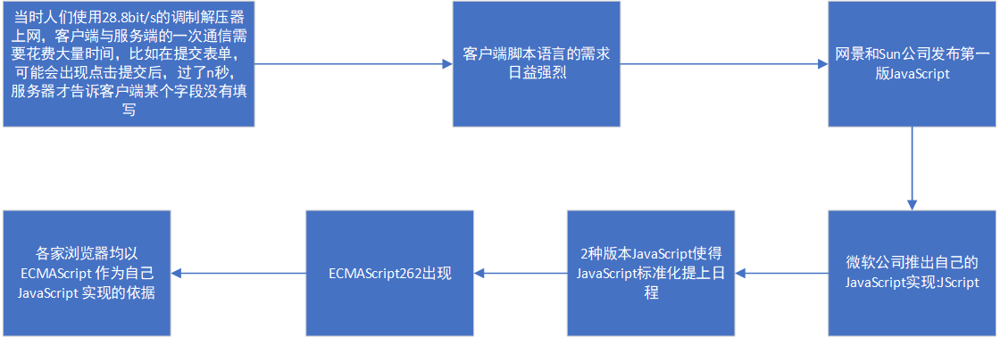
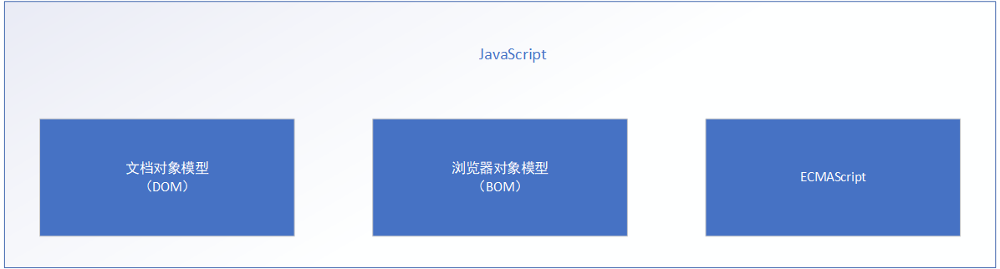
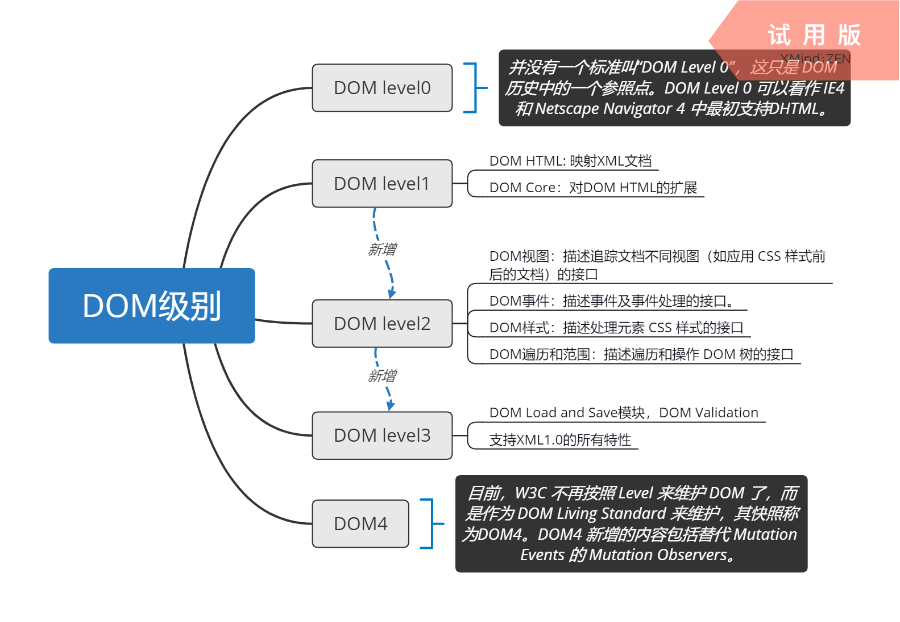
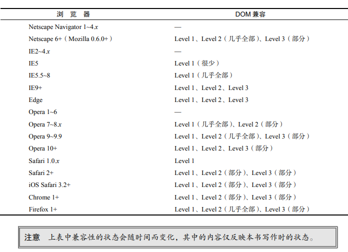

### 历史回顾

### JavaScript与ECMAScript的关系

ECMAScript是JavaScript的标准，JavaScript是ECMAScript的实现

### JavaScript是什么

JavaScript 是一门用来与网页交互的脚本语言，虽然 JavaScript和 ECMAScript 基本上是同义词，但 JavaScript远远不限于 ECMA-262 所定义的那样。完整的JavaScript由以下3部分组成。 

- ECMAScript：由 ECMA-262 定义并提供核心功能。 
- 文档对象模型（DOM）：提供与网页内容交互的方法和接口。
- 浏览器对象模型（BOM）：提供与浏览器交互的方法和接口。

JavaScript 的这三个部分得到了五大 Web 浏览器（IE、Firefox、Chrome、Safari 和 Opera）不同程度 的支持。所有浏览器基本上对 ES5（ECMAScript 5）提供了完善的支持，而对 ES6（ECMAScript 6）和 ES7（ECMAScript 7）的支持度也在不断提升。这些浏览器对 DOM 的支持各不相同，但对 Level 3 的支 持日益趋于规范。HTML5 中收录的 BOM 会因浏览器而异，不过开发者仍然可以假定存在很大一部分 公共特性。

#### ECMAScript

##### ECMAScript本版本

- 第1版，跟JavaScript1.1差不多，只不过删除了所有浏览器特定的代码，外加少量细微的修改
- 第2版，只是做了一些编校工作
- 第3版，标志着 ECMAScript 作为一门真正的编程语言的时代终于到来了。
- 第4版，由于跳跃太大，未发布就被遗弃
- 第5版，实际是JavaScript3.1版本，它作为第5版发布
- 第6版，即ES6
- 第6版以后的版本都只有小改动

##### ECMAScript符合性

要成为 ECMAScript 实现，必须满足下列条件： 
- 支持 ECMA-262 中描述的所有“类型、值、对象、属性、函数，以及程序语法与语义”；
- 支持 Unicode 字符标准。 此外，符合性实现还可以满足下列要求。
- 增加 ECMA-262 中未提及的“额外的类型、值、对象、属性和函数”。ECMA-262 所说的这些额 外内容主要指规范中未给出的新对象或对象的新属性。 
- 支持 ECMA-262 中没有定义的“程序和正则表达式语法”（意思是允许修改和扩展内置的正则表 达式特性）。

以上条件为实现开发者基于 ECMAScript 开发语言提供了极大的权限和灵活度，也是其广受欢迎的 原因之一。

##### 浏览器对ES的兼容

对ES6的兼容：edge,firefox45+,chrome49+,safari9+,opera36+,ios safari9.2+

#### DOM

##### DOM为什么是必要的？

由于网景公司和微软公司使用不同的开发思路实现DHTML,DOM标准提上日程

##### DOM 级别

##### 浏览器对DOM的支持

#### BOM

IE3 和 Netscape Navigator 3 提供了浏览器对象模型（BOM） API，用于支持访问和操作浏览器的窗 口。使用 BOM，开发者可以操控浏览器显示页面之外的部分。而 BOM 真正独一无二的地方，当然也是 问题最多的地方，就是它是唯一一个没有相关标准的 JavaScript 实现。HTML5 改变了这个局面，这个版 本的 HTML 以正式规范的形式涵盖了尽可能多的 BOM 特性。由于 HTML5 的出现，之前很多与 BOM 有关的问题都迎刃而解了。 总体来说，BOM 主要针对浏览器窗口和子窗口（frame），不过人们通常会把任何特定于浏览器的 扩展都归在 BOM 的范畴内。比如，下面就是这样一些扩展： 

- 弹出新浏览器窗口的能力；
- 移动、缩放和关闭浏览器窗口的能力； 
- navigator 对象，提供关于浏览器的详尽信息； 
- location 对象，提供浏览器加载页面的详尽信息；
- screen 对象，提供关于用户屏幕分辨率的详尽信息； 
- performance 对象，提供浏览器内存占用、导航行为和时间统计的详尽信息；  对 cookie 的支持；  其他自定义对象，如 XMLHttpRequest 和 IE 的 ActiveXObject。

 因为在很长时间内都没有标准，所以每个浏览器实现的都是自己的 BOM。有一些所谓的事实标准， 比如对于 window 对象和 navigator 对象，每个浏览器都会给它们定义自己的属性和方法。现在有了 HTML5，BOM 的实现细节应该会日趋一致