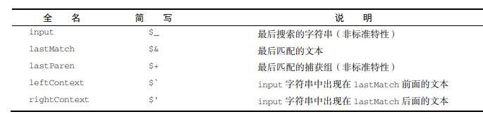

[TOC]

### 一、Date

1. #### new Date

创建日期，不传入参数，则创建当前日期

2. #### Date.parse

传入指定格式的日期参数转为毫秒值，支持以下格式

- “月/日/年”，如"5/23/2019"；
- “月名 日, 年”，如"May 23, 2019"；
- “周几 月名 日 年 时:分:秒 时区”，如"Tue May 23 2019 00:00:00 GMT-0700"；
- ISO 8601 扩展格式“YYYY-MM-DDTHH:mm:ss.sssZ”，如 2019-05-23T00:00:00（只适用于兼容 ES5 的实现）

3. #### Date.UTC

同Date.parse,把指定格式的日期转为毫秒值,但使用不同的格式。参数是年、零起点月数（1 月是 0，2 月是 1，以此类推）、日（1~31）、时（0~23）、分、秒和毫秒。这些参数中，只有前两个（年和月）是必需的。如果不提供日，那么默认为 1 日。其他参数的默认值都是 0。

```javascript
// GMT 时间 2005 年 5 月 5 日下午 5 点 55 分 55 秒
let allFives = new Date(Date.UTC(2005, 4, 5, 17, 55, 55));
```

4. #### Date.now

当前日期的毫秒值

5. #### 继承的方法

- valueOf
- toString
- toLocaleString

6. #### 日期格式化方法

- toDateString()显示日期中的周几、月、日、年（格式特定于实现）；
- toTimeString()显示日期中的时、分、秒和时区（格式特定于实现）；
- toLocaleDateString()显示日期中的周几、月、日、年（格式特定于实现和地区）；
- toLocaleTimeString()显示日期中的时、分、秒（格式特定于实现和地区）；
- toUTCString()显示完整的 UTC 日期（格式特定于实现）。
这些方法的输出与 toLocaleString()和 toString()一样，会因浏览器而异。因此不能用于在
用户界面上一致地显示日期。

7. #### 日期/时间组件方法

- 获取/设置: 毫秒值，年、月、日、小时、分钟、秒、毫秒、星期几
- 返回以分钟计的 UTC 与本地时区的偏移量

### 二、ExpReg

ECMAScript 通过 RegExp 类型支持正则表达式。正则表达式使用类似 Perl 的简洁语法来创建：
let expression = /pattern/flags;
这个正则表达式的**pattern（模式）**可以是任何简单或复杂的正则表达式，包括`字符类、限定符、分组、向前查找和反向引用`。每个正则表达式可以带零个或多个 flags（标记），用于控制正则表达式的行为。下面给出了表示匹配模式的标记。

- g：全局模式，表示查找字符串的全部内容，而不是找到第一个匹配的内容就结束。
- i：不区分大小写，表示在查找匹配时忽略 pattern 和字符串的大小写。
- m：多行模式，表示查找到一行文本末尾时会继续查找。
- y：粘附模式，表示只查找从 lastIndex 开始及之后的字符串。
- u：Unicode 模式，启用 Unicode 匹配。
- s：dotAll 模式，表示元字符.匹配任何字符（包括\n 或\r）。

1. #### 实例属性

每个 RegExp 实例都有下列属性，提供有关模式的各方面信息。

- global：布尔值，表示是否设置了 g 标记。
- ignoreCase：布尔值，表示是否设置了 i 标记。
- unicode：布尔值，表示是否设置了 u 标记。
- sticky：布尔值，表示是否设置了 y 标记。
- lastIndex：整数，表示在源字符串中下一次搜索的开始位置，始终从 0 开始。
- multiline：布尔值，表示是否设置了 m 标记。
- dotAll：布尔值，表示是否设置了 s 标记。
- source：正则表达式的字面量字符串（不是传给构造函数的模式字符串），没有开头和结尾的
斜杠。
- flags：正则表达式的标记字符串。始终以字面量而非传入构造函数的字符串模式形式返回（没
有前后斜杠）。
通过这些属性可以全面了解正则表达式的信息，不过实际开发中用得并不多，因为模式声明中包含
这些信息。下面是一个例子：

  ```javascript
      let pattern1 = /\[bc\]at/i; 
      console.log(pattern1.global); // false 
      console.log(pattern1.ignoreCase); // true 
      console.log(pattern1.multiline); // false 
      console.log(pattern1.lastIndex); // 0 
      console.log(pattern1.source); // "\[bc\]at" 
      console.log(pattern1.flags); // "i" 
      let pattern2 = new RegExp("\\[bc\\]at", "i"); 
      console.log(pattern2.global); // false 
      console.log(pattern2.ignoreCase); // true 
      console.log(pattern2.multiline); // false 
      console.log(pattern2.lastIndex); // 0 
      console.log(pattern2.source); // "\[bc\]at" 
      console.log(pattern2.flags); // "i" 
  ```

  注意，虽然第一个模式是通过字面量创建的，第二个模式是通过 RegExp 构造函数创建的，但两个模式的 source 和 flags 属性是相同的。source 和 flags 属性返回的是规范化之后可以在字面量中使用的形式。

2. #### 实例方法

- exec
  RegExp 实例的主要方法是 exec()，主要用于**配合捕获组使用**。这个方法只接收一个参数，即要应用模式的字符串。如果找到了匹配项，则返回包含第一个匹配信息的数组；如果没找到匹配项，则返回null。返回的数组虽然是 Array 的实例，但包含两个额外的属性：index 和 input。index 是字符串中匹配模式的起始位置，input 是要查找的字符串。*这个数组的第一个元素是匹配整个模式的字符串，其他元素是与表达式中的捕获组匹配的字符串*。如果模式中没有捕获组，则数组只包含一个元素

  ```javascript
      //  1>不设置全局模式
      // 无论执行多少次都是同一个结果
          let text = "cat, bat, sat, fat"; 
          let pattern = /.at/g; 
          let matches = pattern.exec(text); 
          console.log(matches.index); // 0 
          console.log(matches[0]); // cat 
          console.log(pattern.lastIndex); // 3 
          matches = pattern.exec(text); 
          console.log(matches.index); // 0 
          console.log(matches[0]); // cat 
          console.log(pattern.lastIndex); // 3 
      //  2>设置全局模式
          let text = "cat, bat, sat, fat"; 
          let pattern = /.at/g; 
          let matches = pattern.exec(text); 
          console.log(matches.index); // 0 
          console.log(matches[0]); // cat 
          console.log(pattern.lastIndex); // 3 
          matches = pattern.exec(text); 
          console.log(matches.index); // 5 
          console.log(matches[0]); // bat 
          console.log(pattern.lastIndex); // 8 
          matches = pattern.exec(text); 
          console.log(matches.index); // 10 
          console.log(matches[0]); // sat 
          console.log(pattern.lastIndex); // 13 
      //  3>与设置y粘性匹配对比
          let text = "cat, bat, sat, fat"; 
          let pattern = /.at/y; 
          let matches = pattern.exec(text); 
          console.log(matches.index); // 0 
          console.log(matches[0]); // cat 
          console.log(pattern.lastIndex); // 3 
          // 以索引 3 对应的字符开头找不到匹配项，因此 exec()返回 null 
          // exec()没找到匹配项，于是将 lastIndex 设置为 0 
          matches = pattern.exec(text); 
          console.log(matches); // null 
          console.log(pattern.lastIndex); // 0 
          // 向前设置 lastIndex 可以让粘附的模式通过 exec()找到下一个匹配项：
          pattern.lastIndex = 5; 
          matches = pattern.exec(text); 
          console.log(matches.index); // 5 
          console.log(matches[0]); // bat 
          console.log(pattern.lastIndex); // 8 
      //  4>与match对比
          let text = "cat, bat, sat, fat"; 
          let pattern = /.at/g; 
          let matches = text.match(pattern); 
          console.log(matches); //  ["cat", "bat", "sat", "fat"] 
  ```

- test
    接收一个字符串参数。如果输入的文本与模式匹配，则参数 返回 true，否则返回 false。这个方法适用于只想测试模式是否匹配，而不需要实际匹配内容的情况。

3. #### RexExp构造函数属性

      构造函数本身也有几个属性，在其他语言里称为静态属性。



```javascript
    // 使用全名
    let text = "this has been a short summer"; 
    let pattern = /(.)hort/g; 
    if (pattern.test(text)) { 
    console.log(RegExp.input); // this has been a short summer 
    console.log(RegExp.leftContext); // this has been a 
    console.log(RegExp.rightContext); // summer 
    console.log(RegExp.lastMatch); // short 
    console.log(RegExp.lastParen); // s 
    } 
    
    // 使用简写
    let text = "this has been a short summer"; 
    let pattern = /(.)hort/g; 
    /* 
    * 注意：Opera 不支持简写属性名
    * IE 不支持多行匹配
    */ 
    if (pattern.test(text)) { 
    console.log(RegExp.$_); // this has been a short summer 
    console.log(RegExp["$`"]); // this has been a 
    console.log(RegExp["$'"]); // summer 
    console.log(RegExp["$&"]); // short 
    console.log(RegExp["$+"]); // s 
    } 
```

  RegExp 还有其他几个构造函数属性，可以存储最多 9 个捕获组的匹配项。这些属性通过 RegExp.$1~RegExp.$9 来访问，分别包含第 1~9 个捕获组的匹配项

### 三、原始值包装类型

  引用类型与原始值包装类型的主要区别在于对象的生命周期。在通过 new 实例化引用类型后，得到 的实例会在离开作用域时被销毁，而自动创建的原始值包装对象则只存在于访问它的那行代码执行期 间。这意味着不能在运行时给原始值添加属性和方法。总结特点如下：

- 每种包装类型都映射到同名的原始类型。
- 以读模式访问原始值时，后台会实例化一个原始值包装类型的对象，借助这个对象可以操作相
    应的数据。
- 涉及原始值的语句执行完毕后，包装对象就会被销毁。

1. #### Boolean

所有原始值包装对象都会转换为布尔值 true

2. #### Number

- toFixed 方法接收一个参数，表示小数点个数
- toExponential 返回科学计数法
- toPrecision 方法接收一个参数，表示结果中数字的总位数（不包含指数）
- isInteger 判断一个数是不是整数
- isSafeInteger 判断一个数是不是范围里的整数

```javascript
  let num = 10.005; 
  console.log(num.toFixed(2)); // "10.01"
  let num = 10; 
  console.log(num.toExponential(1)); // "1.0e+1"
  let num = 99; 
  console.log(num.toPrecision(1)); // "1e+2" 
  console.log(num.toPrecision(2)); // "99" 
  console.log(num.toPrecision(3)); // "99.0" 
```

3. #### String

- charAt,charCode和fromCharCode

    JavaScript字符串由 **16 位码元（code unit）**组成。*对多数字符来说*，每 16 位码元对应一个字符。换
    句话说，*字符串的 length 属性表示字符串包含多少 16 位码元*，JavaScript 字符串使用了两种 Unicode 编码混合的策略：`UCS-2 和 UTF-16`。对于可以采用 16 位编码 的字符（U+0000~U+FFFF），这两种编码实际上是一样的。

    | 方法名       | 作用                                                         |
    | ------------ | :----------------------------------------------------------- |
    | charAt       | 查找指定索引位置的 16 位码元，并返回该码元对应的字符         |
    | charCodeAt   | 查找指定索引位置的 16 位码元对应的字符的编码，如 'ab'.charCodeAt(1)为 98, 写成 16 进制数为0x62 |
    | fromCharCode | 将指定的字符编码转为对应字符，如String.fromCharCode(0x62, 99)为 bc |

- pointCode、fromPonitCode和normalize

    对于`U+0000~U+FFFF` 范围内的字符，length、charAt()、charCodeAt()和 fromCharCode() 返回的结果都跟预期是一样的。这是因为在这个范围内，每个字符都是用 16 位表示的，而这几个方法 也都基于 16 位码元完成操作。只要字符编码大小与码元大小一一对应，这些方法就能如期工作。 这个对应关系在扩展到 Unicode 增补字符平面时就不成立了。问题很简单，即 16 位只能唯一表示 65 536 个字符。这对于大多数语言字符集是足够了，在 Unicode 中称为`基本多语言平面（BMP）`。为了 表示更多的字符，Unicode 采用了一个策略，即每个字符使用另外 16 位去选择一个增补平面。这种每个 字符使用两个 16 位码元的策略称为`代理对`。一个代理对对应一个字符。

    为正确解析**既包含单码元字符又包含代理对字符的字符串**，可以使用 codePointAt()来代替 charCodeAt()。跟使用 charCodeAt()时类似，codePointAt()接收 16 位码元的索引并返回该索引 位置上的码点（code point）。码点是 Unicode 中一个字符的完整标识。比如，"c"的码点是 0x0063，而 "☺"的码点是 0x1F60A。码点可能是 16 位，也可能是 32 位，而 codePointAt()方法可以从指定码元 位置识别完整的码点。与 charCodeAt()有对应的 codePointAt()一样，fromCharCode()也有一个对应的 fromCodePoint()。

    某些 Unicode 字符可以有多种编码方式。有的字符既可以通过一个 BMP 字符表示，也可以通过一 个代理对表示。为解决这个问题，Unicode提供了 4种规范化形式，可以将类似上面的字符规范化为一致的格式，无论 底层字符的代码是什么。这 4种规范化形式是：NFD（Normalization Form D）、NFC（Normalization Form C）、 NFKD（Normalization Form KD）和 NFKC（Normalization Form KC）。可以使用 normalize()方法对字 符串应用上述规范化形式，使用时需要传入表示哪种形式的字符串："NFD"、"NFC"、"NFKD"或"NFKC"

- 字符串其他方法

    | 方法名      | 作用                                     |
    | :---------- | ---------------------------------------- |
    | concat      | 用于将一个或多个字符串拼接成一个新字符串   |
    | substring   |                                          |
    | substr      |                                          |
    | slice       |                                          |
    | lastIndexOf |                                          |
    | indexOf     |                                          |
    | startsWith  |                                          |
    | endWith     |                                          |
    | includes    |                                          |
    | trim        |                                          |
    | padStart    |                                          |
    | padEnd      |                                          |
    | @@iterator  |                                          |
    | toLowerCase |                                          |
    | toLocaleLowerCase |                                    |
    | toUpperCase |                                          |
    | toLocaleUpperCase |                                    |
    | match |                                                |
    | search |                                               |
    | replace |                                              |
    | split |                                                |
    | localeCompare |                                        |

### 四、单例内置对象

  当代码开始执行时，全局上下文中会存在两个内置对象：Global 和 Math。其中，Global 对象在大多数 ECMAScript 实现中无法直接访问。不过，浏览器将其实现为 window 对象。所有全局变量和函数都是 Global 对象的属性。Math 对象包含辅助完成复杂计算的属性和方法。

1. ### global

- URI编码： encodeURI/decodeURI, encodeURIComponent/decodeURIComponent
- eval语句：相当于一个完整的ECMAScript解释器，严格模式下外部无法访问eval内部的变量，不建议使用
- window对象: global对象的代理

2. ### Math
