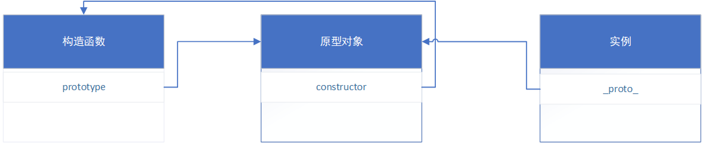
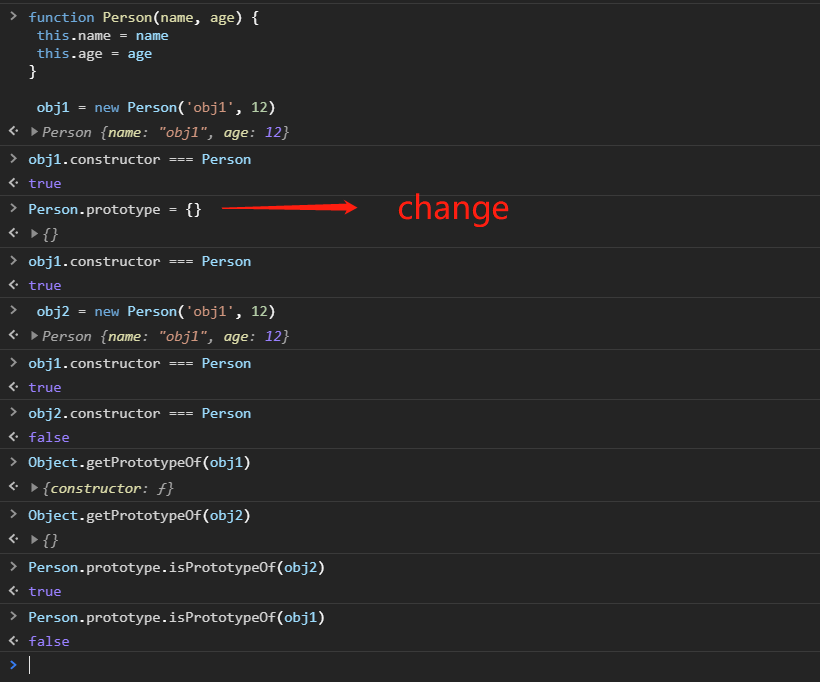

### 理解对象
对象可以通过new Object或字面量的形式{}创建，对象拥有`属性`和`方法`。让我们先理解对象的属性，都有哪些类型？
#### 属性的类型
对象的属性类型可以分为2类: 数据属性和访问器属性。
1. 数据属性
数据属性包含一个保存数据值的`位置`。值会从这个位置`读取`，也会`写入`到这个位置。数据属性有 `4个特性`描述它们的行为。

- [[Configurable]] 描述表示属性是否可以通过 `delete` 删除并重新定义，是否可以修改它的特性，以及是否可以把它改为访问器属性
- [[Enumerable]] 描述是否可以被`for-in`遍历到，默认为true
- [[Writable]] 描述是否可以修改值，默认为true
- [[Value]] 存放属性的值，**这就是前面提到的那个读取和写入属性值的位置**。默认为undefined

那么，我们怎么去定义或修改属性以上的4个特性呢，答案是使用`Object.defineProperty()`方法，这个方法接收 3 个参数：要给其添加属性的对象、属性的名称和一个描述符对象。最后一个参数。如下示例：

```javascript
// 定义一个对象
let obj = {
  name: '测试Object.defineProperty'
}
// 使用Object.defineProperty修改
Object.defineProperty(obj, 'name', {
  value: '第一次修改'
})
console.log(obj.name) // c

// 使用Object.defineProperty创建新的属性
Object.defineProperty(obj, 'age', {
  value: 18,
  enumerable: false
})
console.log(obj) // {name: '第一次修改', age: 18}

for (let key in obj) { // 这里只打印出name,因为age的[[Enumerable]]特性设置为false
  console.log(key)
}
// name

// 设置writale为false,则数据的值不可修改
Object.defineProperty(obj, 'name', {
  writable: false
})
obj.name = '第二次修改？'
console.log(obj.name) // 第一次修改

// 设置configurable为false,则数据不可配置且无法再修改成true了
Object.defineProperty(obj, 'age', {
  configurable: false
})
obj.age = 20
console.log(obj.age) // 18
Object.defineProperty(obj, 'age', { // 报错 Cannot redefine property: age
  configurable: true
})
```
2. 访问器属性
访问器属性不包含数据值。相反，它们包含一个获取（getter）函数和一个设置（setter）函数，不过这两个函数不是必需的。在读取访问器属性时，会调用获取函数，这个函数的责任就是返回一个有效的值。在写入访问器属性时，会调用设置函数并传入新值，这个函数必须决定对数据做出什么修改。访问器属性有 4 个特性描述它们的行为

- [[Configurable]] 描述表示属性是否可以通过 `delete` 删除并重新定义，是否可以修改它的特性，以及是否可以把它改为访问器属性
- [[Enumerable]] 描述是否可以被`for-in`遍历到，默认为true
- [[Set]] 设置函数，写入属性时调用，默认为undefined
- [[Get]] 获取函数，读取属性时调用，默认为undefined

```javascript
let book = { 
 year_: 2017, 
 edition: 1
}
Object.defineProperty(book, "year", { // year就是访问器属性
 get() { 
 return this.year_; 
 }, 
 set(newValue) { 
 if (newValue > 2017) { 
 this.year_ = newValue; 
 this.edition += newValue - 2017; 
 } 
 } 
}); 
book.year = 2018; // 通过对year设值，影响到year_和edition的值
console.log(book.edition); // 2 
```
Object.defineProperty()方法只能对一个属性进行配置，如果我们要同时配置多个属性呢？可以使用`Object.defineProperties()`方法，该方法接收2个参数，属性所在的对象和要取得其描述符的属性名。返回值是一个对象，对于访问器属性包含configurable、enumerable、get 和 set 属性，对于数据属性包含 configurable、enumerable、writable 和 value 属性。

```javascript
let book = {}; 
Object.defineProperties(book, { 
 year_: { 
 value: 2017 
 }, 
 edition: { 
 value: 1 
 }, 
 year: { 
 get: function() { 
 return this.year_; 
 }, 
 set: function(newValue){ 
 if (newValue > 2017) { 
 this.year_ = newValue; 
 this.edition += newValue - 2017; 
 } 
 } 
 } 
});
```
到这里，我们知道对象的属性分为数据属性和访问器属性，每种属性都有4个特性，我们可以使用Object.defineProperty或Object.defineProperties配置对象的这些属性特性（描述符）。那么我们怎么获取一个对象的描述符呢？

#### 读取属性的特性
使用 `Object.getOwnPropertyDescriptor()`方法可以取得指定属性的属性描述符。这个方法接收两个参数：属性所在的对象和要取得其描述符的属性名。返回值是一个对象，对于访问器属性包含configurable、enumerable、get 和 set 属性，对于数据属性包含 configurable、enumerable、writable 和 value 属性。使用`Object.getOwnPropertyDescriptors()`则获取对象所有属性的描述符。

```javascript
let book = {}; 
Object.defineProperties(book, { 
 year_: { 
 value: 2017 
 }, 
 edition: { 
 value: 1 
 }, 
 year: { 
 get: function() { 
 return this.year_; 
 }, 
 set: function(newValue){ 
 if (newValue > 2017) { 
 this.year_ = newValue; 
 this.edition += newValue - 2017; 
 } 
 } 
 } 
});

console.log(Object.getOwnPropertyDescriptor(book, 'year_')) 
// {
//     "value": 2017,
//     "writable": true,
//     "enumerable": true,
//     "configurable": true
// }
console.log(Object.getOwnPropertyDescriptors(book))
// {
//   edition:{
//     configurable: true
//     enumerable: true
//     value: 1
//     writable: true
//   },

//   year: {
//     configurable: false
//     enumerable: false
//     get: ƒ get()
//     set: ƒ set(newValue)
//   },
//   year_ {
//     configurable: true
//     enumerable: true
//     value: 2017
//     writable: true
//   }
// }
```
#### 合并对象
ECMAScript 6 专门为合并对象提供了 `Object.assign()`方法。这个方法接收一个目标对象和一个或多个源对象作为参数，然后将每个源对象中可枚举（`Object.propertyIsEnumerable()`返回 true）和自有（`Object.hasOwnProperty()`返回 true）属性复制到目标对象。以字符串和符号为键的属性会被复制。对每个符合条件的属性，这个方法会使用源对象上的[[Get]]取得属性的值，然后使用目标对象上的[[Set]]设置属性的值。

#### Object.is()

#### 对象解构
```javascript
let person = {
  name: 'p',
  age: 11,
  major: 'computer',
  hobby: undefined
}
let { name, age } = person
console.log(name, age) // p, 11

// 如果变量已经事先声明
let major
({major} = person) // 需要用()包裹
console.log(major) // computer

// 如果变量与属性名不同
let {name: name1, age: age1} = person
console.log(name1, age1) // p, 11

// 如果变量找不到匹配项，且没有默认值，则结果为undefined
let { grade } = person
console.log(grade) // undefined

// 如果结果为undefined,有默认值，则结果为默认值
let {hobby = 'sports', sex = 'female'} = person
console.log(sex, hobby) // female, sports
```
- 嵌套解构
```javascript
let person = {
  name: 'p',
  age: 11,
  major: 'computer',
  job: {
    title: 'engineer'
  }
}

let {name, job: {title}} = person
console.log(title) // engineer
console.log(job) // job is undefined

let copyPerson = {}
({ name: copyPerson.name, age: copyPerson.age } = person)
console.log(copyPerson)
// {
    // "name": "p",
    // "age": 11
// }
```
- 部分解构
```javascript
let person = { 
 name: 'Matt', 
 age: 27 
}; 
let personName, personBar, personAge; 
try { 
 // person.foo 是 undefined，因此会抛出错误
 ({name: personName, foo: { bar: personBar }, age: personAge} = person); 
} catch(e) {} 
console.log(personName, personBar, personAge); 
// Matt, undefined, undefined
```
- 参数上下文匹配
```javascript
let person = { 
 name: 'Matt', 
 age: 27 
}; 
function printPerson(foo, {name, age}, bar) { 
 console.log(arguments); 
 console.log(name, age); 
} 
function printPerson2(foo, {name: personName, age: personAge}, bar) { 
 console.log(arguments); 
 console.log(personName, personAge); 
} 
printPerson('1st', person, '2nd'); 
// ['1st', { name: 'Matt', age: 27 }, '2nd'] 
// 'Matt', 27 
printPerson2('1st', person, '2nd'); 
// ['1st', { name: 'Matt', age: 27 }, '2nd'] 
// 'Matt', 27
```
### 创建对象
#### 工厂模式
```javascript
function factory(name, age) {
  let obj = new Object()
  obj.name = name
  obj.age = age
  obj.say = function(){return this.name}
  return obj
}
let obj1 = factory('obj1', 12)
let obj2 = factory('obj2', 24)
```
#### 构造函数模式
```javascript
function Constructor(name, age) {
 this.name = name
 this.age = age
 this.say = function(){return this.name}
}

let obj1 = new Constructor('obj1', 12)
let obj2 = new Constructor('obj2', 24)
```
#### 原型模式
```javascript
function Proto() {
}
Proto.prototype.say = function(){return this.name}
Proto.prototype.name = 'yh'
Proto.prototype.age = 22

let obj1 = new Proto()
let obj2 = new Proto()
```


**new的过程发生了哪些事情？**

(1) 在内存中创建一个新对象。

(2) 这个新对象内部的[[Prototype]]特性被赋值为构造函数的 prototype 属性。

(3) 构造函数内部的 this 被赋值为这个新对象（即 this 指向新对象）。

(4) 执行构造函数内部的代码（给新对象添加属性）。

(5) 如果构造函数返回非空对象，则返回该对象；否则，返回刚创建的新对象


prototype, __proto__和构造函数的关系:



改变构造函数prototype的指向



获取或属性：（区分属性在实例还是原型上，属性的键是Symbol还是非Symbol,属性是否可枚举），一个测试例子：
```javascript
function Test(name = 'name', age = 100){
this.age = age
this.name_ = name
this[Symbol.for('s')] = 'symbol'
Object.defineProperties(this, {
name: {
get (){
return this.name_
},
set(val){
this.name_ = val
}
},
params1: {
value: '可枚举'
},
params2:{
value: '不可枚举',
enumerable: false
}
})
}
Test.prototype.desc = '原型上的属性'
let test = new Test()


for (let key in test) { // 获得对象上所有可枚举的属性，包括原型属性，不包括使用Object.defineProperty和Object.defineProperties定义的属性
  console.log(key)
}

Object.keys(test) // 获得对象上所有可枚举的实例属性,不包括使用Object.defineProperty和Object.defineProperties定义的属性

Reflect.ownKeys(test) // 获取实例的所有属性 = Object.getOwnPropertyName + Object.getOwnPropertySymbols

Object.getOwnPropertyNames(test) // 获取实例的所有非symbol键的属性

Object.getOwnPropertySymbols(test) // // 获取实例的所有symbol键的属性


```
**只要通过对象可以访问**，in 操作符就返回 true，而 hasOwnProperty()只有属性存在于实例上时才返回 true。因此，只要 in 操作符返回 true 且 hasOwnProperty()返回 false，就说明该属性是一个原型属性。

#### 对象迭代
- Object.entries()
- Object.values()
### 类

### 继承
实现继承是 ECMAScript 唯一支持的继承方式，而这主要是通过原型链实现的。